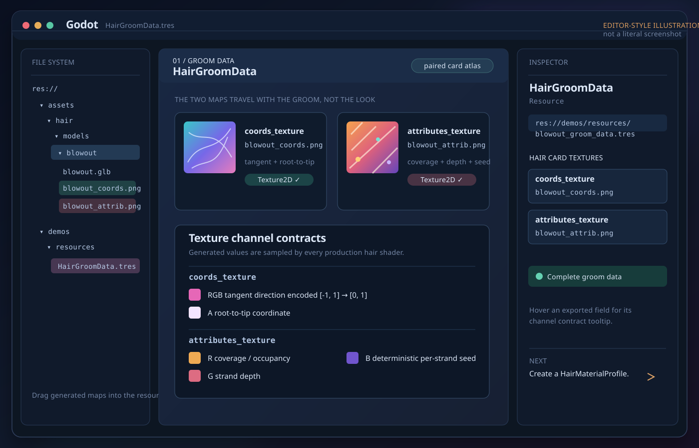
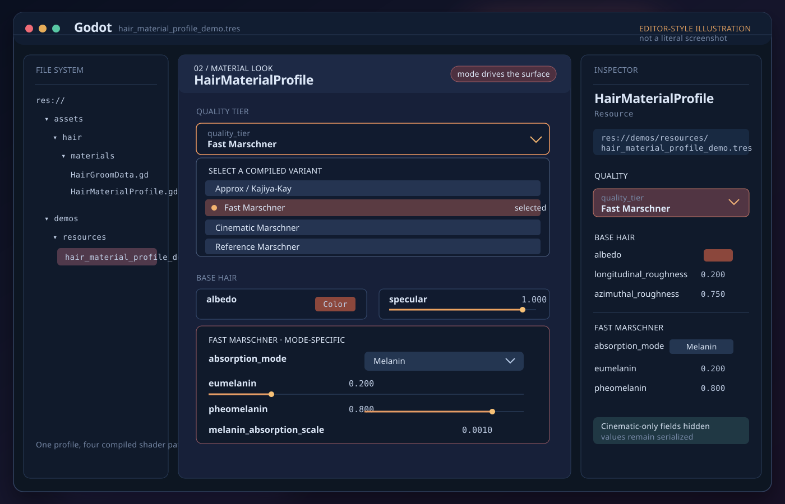
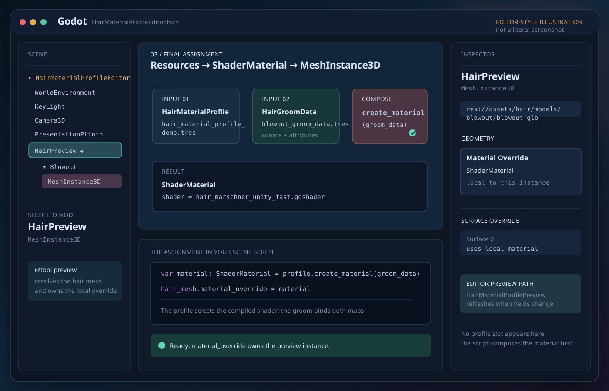

# Godot Marschner Hair Shader

A Godot 4.7 hair-card shading implementation with explicit production quality tiers:

- **Approx / Kajiya-Kay** — lightweight non-Marschner fallback.
- **Fast Marschner** — Unity HDRP Standard-style Marschner with a preintegrated azimuthal LUT.
- **Cinematic Marschner** — higher-fidelity Marschner using the conditioned longitudinal LUT while retaining analytic azimuthal/attenuation behavior.
- **Reference Marschner** — analytic baseline intended primarily for comparison and validation.

The project intentionally keeps these as **separate compiled shaders**. `HairMaterialProfile` provides a single authoring API and switches the material to the appropriate shader instead of compiling one runtime-branching mega-shader.

## Requirements

- Godot 4.7.
- Hair-card meshes with the groom data textures described below.
- Fast and Cinematic modes require their generated LUT resources.

## Quick start

### 1. Create groom data

Create a `HairGroomData` resource and assign the two textures generated for the hair-card atlas:

```text
coords_texture
  RGB = strand tangent encoded from [-1, 1] into [0, 1]
  A   = root-to-tip coordinate

attributes_texture
  R = coverage / occupancy
  G = strand depth
  B = deterministic per-strand seed
```

These maps describe the groom/card atlas and are intentionally separate from the hair appearance. A single `HairMaterialProfile` can therefore be reused with multiple `HairGroomData` resources.

### 2. Create a material profile

Create a `HairMaterialProfile` resource and choose `quality_tier` in the Inspector.

The Inspector automatically hides controls that do not affect the selected shader. Values remain serialized when hidden, so switching tiers does not discard tier-specific settings.

### 3. Build or update the ShaderMaterial

Create a material from scratch:

```gdscript
@export var profile: HairMaterialProfile
@export var groom_data: Resource
@export var hair_mesh: MeshInstance3D

func _ready() -> void:
    var material: ShaderMaterial = profile.create_material(groom_data)
    hair_mesh.material_override = material
```

Or apply a profile and groom to an existing `ShaderMaterial`:

```gdscript
var ok: bool = profile.apply_to(shader_material, groom_data)
if not ok:
    push_error("Hair material setup failed.")
```

`apply_to()` validates a non-null groom resource before mutating the material. An unrelated `Resource` is rejected instead of silently leaving the material without groom textures.

### 4. Generate LUTs for Fast and Cinematic

Fast Marschner expects:

```text
res://benchmark/resources/luts/unity_azimuthal_64.res
```

Generate it with:

```bash
godot --headless --path . --script res://benchmark/tools/generate_unity_hair_azimuthal_lut.gd
```

Cinematic Marschner expects:

```text
res://benchmark/resources/luts/cinematic_longitudinal_kernel_128x128x64.res
```

Generate it with:

```bash
godot --headless --path . --script res://benchmark/tools/generate_marschner_cinematic_longitudinal_lut.gd
```

Custom LUT data resources can be supplied through the corresponding `HairMaterialProfile` override fields.

## Editor support and hints

Godot exposes the authoring API directly in the Inspector:

- `@export_enum` presents shader and absorption modes as dropdowns.
- `@export_range` constrains numeric controls to their intended authoring ranges.
- export categories organize the material controls by tier.
- `HairMaterialProfile` dynamically hides properties that do not affect the selected tier.
- the preview's `groom_data` field keeps parser-safe `Resource` typing while exposing a `HairGroomData` resource-type hint in the Inspector.
- GDScript `##` documentation comments on exported properties are displayed by Godot as Inspector tooltips.

The included preview scene is useful for interactive authoring:

```text
res://demos/HairMaterialProfileEditor.tscn
```

Assign a `HairMaterialProfile` and `HairGroomData`, then switch `quality_tier` to compare the compiled variants in the editor viewport.

## New groom setup — visual walkthrough

The quick-start path above is the complete workflow. The three editor-style SVG illustrations below make the hand-off between resources and the final mesh easier to scan. They are **illustrations, not literal screenshots**; the labels and paths mirror this project’s actual Inspector fields and assets.

### 1. Bind the groom maps

1. In the FileSystem dock, open `res://demos/resources/`.
2. Right-click the folder, choose **New > Resource...**, select `HairGroomData`, and save the resource as `new_groom_data.tres`.
3. Select the new resource and assign these generated maps in the Inspector:
   - `coords_texture` → `res://assets/hair/models/blowout/blowout_coords.png`
   - `attributes_texture` → `res://assets/hair/models/blowout/blowout_attrib.png`

[](docs/images/new-groom-01-hair-groom-data.svg)

*Illustration 1 — `HairGroomData` owns the card-atlas maps; the channel contracts are not appearance-texture slots.*

### 2. Choose the material mode

1. In the same folder, choose **New > Resource... > HairMaterialProfile**, then save it as `new_hair_material_profile.tres`.
2. Select the profile and open **Quality > `quality_tier`** in the Inspector.
3. Choose one of `Approx / Kajiya-Kay`, `Fast Marschner`, `Cinematic Marschner`, or `Reference Marschner`.
4. Edit the visible common fields under **Base Hair**. The selected mode reveals its own controls—for example, Fast Marschner exposes `absorption_mode` and its mode-specific absorption fields.

[](docs/images/new-groom-02-hair-material-profile.svg)

*Illustration 2 — `quality_tier` selects the compiled shader and the Inspector hides controls that do not affect that mode.*

### 3. Put the material on the hair mesh

For the included editor preview:

1. Open `res://demos/HairMaterialProfileEditor.tscn`.
2. Select the root `HairMaterialProfileEditor` node. In **Hair Setup**, assign `material_profile` to `res://demos/resources/hair_material_profile_demo.tres` and `groom_data` to `res://demos/resources/blowout_groom_data.tres`.
3. The `@tool` preview resolves the `HairPreview` MeshInstance3D and writes the generated `ShaderMaterial` to its `material_override`. Change `quality_tier` and watch the editor viewport refresh.

For your own scene, the final assignment is the same API shown in Quick start:

```gdscript
var material: ShaderMaterial = profile.create_material(groom_data)
hair_mesh.material_override = material
```

[](docs/images/new-groom-03-material-assignment.svg)

*Illustration 3 — profile + groom data become a `ShaderMaterial`, then land on `MeshInstance3D.material_override`.*

### Caveats

- Keep `coords_texture` and `attributes_texture` paired with the card atlas and UVs that generated them. They are groom-specific shader data, not standard glTF metallic-roughness textures.
- Preserve channel accuracy. In Godot’s texture import settings, prefer **Lossless** compression when artifacts alter coverage, tangent, depth, or seed values. The production shaders declare both maps with nearest filtering.
- Fast Marschner needs `res://benchmark/resources/luts/unity_azimuthal_64.res`; Cinematic Marschner needs `res://benchmark/resources/luts/cinematic_longitudinal_kernel_128x128x64.res`. Generate missing LUTs before relying on those modes.
- A MeshInstance3D has no direct `HairMaterialProfile` property. Use the included preview script or call `create_material()` / `apply_to()` from your scene script; do not expect dragging a profile onto `Material Override` to perform the composition.

## Choosing a shader tier

| Tier | Intended use | Important controls/resources |
| --- | --- | --- |
| Approx / Kajiya-Kay | Simple fallback and non-Marschner comparison | Primary/secondary Kajiya-Kay lobes and scatter |
| Fast Marschner | Production Marschner path using the Unity-style approximation | Absorption mode + Unity azimuthal LUT; IOR is pinned to the LUT eta |
| Cinematic Marschner | Higher-fidelity Marschner path | Arbitrary IOR + Cinematic longitudinal LUT |
| Reference Marschner | Analytic comparison/validation baseline | Existing analytic shader interface |

Fast's Unity-style LUT contract is built around eta `1.55`; `HairMarschnerLUTAdapter` binds the LUT metadata and pins the shader IOR accordingly. Cinematic keeps its IOR authorable.

## Material versus groom ownership

```text
HairMaterialProfile                 HairGroomData
-------------------                 -------------
quality tier                         coords_texture
hair color                           attributes_texture
longitudinal roughness
azimuthal roughness
specular strength
cuticle tilt
absorption / melanin
mode-specific LUT overrides
Kajiya-Kay controls
```

Do not treat `coords_texture` or `attributes_texture` as ordinary appearance textures. They are groom-specific shader data and must correspond to the card atlas/UVs used by the mesh.

## API reference

### `HairMaterialProfile`

Path:

```text
res://assets/hair/materials/HairMaterialProfile.gd
```

#### `quality_tier: int`

Selects the compiled shader variant.

```text
0 = Approx / Kajiya-Kay
1 = Fast Marschner
2 = Cinematic Marschner
3 = Reference Marschner
```

Prefer using `HairMaterialProfile.QualityTier` constants in code instead of hard-coded integers.

#### `get_shader_resource() -> Shader`

Returns the compiled shader resource selected by `quality_tier`.

#### `apply_to(material: ShaderMaterial, groom_data: Resource = null) -> bool`

Primary authoring/runtime entry point.

It:

1. validates a supplied groom resource;
2. selects the compiled shader for `quality_tier`;
3. preserves shared caller-owned groom/debug parameters across a shader swap;
4. applies profile properties supported by the target shader;
5. binds the Fast or Cinematic LUT when required;
6. explicitly binds `HairGroomData` textures when supplied.

Returns `false` when the material is invalid, the groom resource is incompatible/incomplete, or a required LUT cannot be bound.

#### `create_material(groom_data: Resource = null) -> ShaderMaterial`

Creates a new `ShaderMaterial` and applies this profile plus the optional groom data.

This is a convenience constructor. It returns the material even when a LUT prerequisite is missing so the resource assignment can be inspected and corrected. Use `apply_to()` directly when the boolean success result is required by application logic.

#### `apply_to_shader_material(material: ShaderMaterial) -> void`

Compatibility API for benchmark or experimental callers that deliberately own shader selection. It applies values supported by the material's **current shader** and does not replace `material.shader`.

#### `bind_mode_resources(material: ShaderMaterial) -> bool`

Binds only the LUT required by the material's current production shader. Returns `true` for modes that do not require a production LUT.

#### `bind_quality_resources(material: ShaderMaterial) -> bool`

Compatibility alias for `bind_mode_resources()`.

### `HairGroomData`

Path:

```text
res://assets/hair/materials/HairGroomData.gd
```

#### `coords_texture: Texture2D`

Groom coordinate map. RGB stores encoded strand tangent; alpha stores root-to-tip position.

#### `attributes_texture: Texture2D`

Groom attribute map. R stores coverage, G depth, and B deterministic strand seed.

#### `is_complete() -> bool`

Returns `true` when both required groom maps are assigned.

#### `validation_message() -> String`

Returns an empty string when complete, otherwise a human-readable list of missing groom fields.

#### `apply_to_shader_material(material: ShaderMaterial, warn_on_failure: bool = true) -> bool`

Validates that the material exposes the shared groom texture contract and binds both groom textures.

#### `from_shader_material(material: ShaderMaterial) -> Resource`

Migration helper for older generated hair materials. Creates a new groom-data resource by reading `coords_texture` and `attributes_texture` from the source material without modifying it.

Example:

```gdscript
var groom_data: Resource = HairGroomData.from_shader_material(old_hair_material)
ResourceSaver.save(groom_data, "res://hair/my_groom_data.tres")
```

### `HairMarschnerLUTAdapter`

Path:

```text
res://assets/hair/materials/HairMarschnerLUTAdapter.gd
```

Normally used internally by `HairMaterialProfile`. It validates generated LUT metadata, reconstructs/caches `Texture3D` resources, binds Fast/Cinematic shader parameters, and exposes `missing_default_resources()` for diagnosing missing generated LUT files.

## Preserved material parameters

When `HairMaterialProfile.apply_to()` switches compiled shader variants, it preserves compatible caller-owned parameters including:

```text
coords_texture
attributes_texture
show_hair_cards
show_hashed_strands
freeze_bayer_phase
comparison_exposure_gain
lobe_scales
use_area_light_multipliers
```

Explicit `HairGroomData` takes precedence over preserved groom textures when supplied.

## Imported / legacy groom migration

Older generated assets may already contain the two groom textures inside a source `ShaderMaterial`. They can continue to work because shared parameters are preserved across tier switches.

For new authoring, prefer extracting the maps into a `HairGroomData` resource:

```gdscript
var groom_data: Resource = HairGroomData.from_shader_material(existing_material)
```

This makes groom data explicit and lets the hair appearance profile be reused independently.

The groom maps are project-specific data consumed by these shaders; they are not part of the standard glTF metallic-roughness material texture set. If the hair-card mesh is delivered through glTF, keep these groom maps as associated project/import assets and bind them through `HairGroomData` after import.

## Validation

Groom/card and editor contract:

```bash
godot --headless --path . --script res://benchmark/tests/test_hair_groom_binding.gd
```

Production profile/LUT contract:

```bash
godot --headless --path . --script res://benchmark/tests/test_marschner_production_profile.gd
```

Expected success markers:

```text
HAIR_GROOM_BINDING_TEST_OK
MARSCHNER_PRODUCTION_PROFILE_TEST_OK
```

## Further documentation

See [`docs/hair_material_authoring.md`](docs/hair_material_authoring.md) for the architecture and detailed authoring behavior behind the profile/groom split, shared card preparation, preview workflow, and shader-tier separation.
