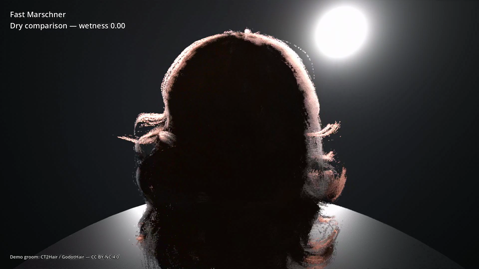
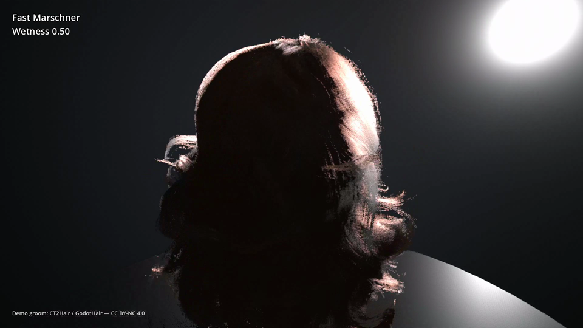
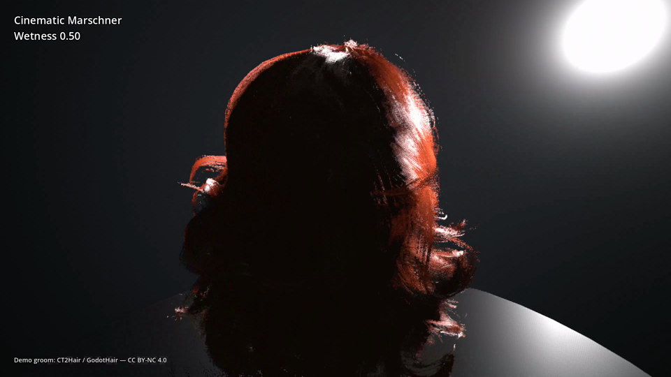

# Godot Marschner Hair Shader

A Godot 4.7 hair-card shading stack with four explicit production quality tiers, viewport-aware coverage, packaged 3D LUT resources, and a shared optical-wetness model.

- **Approx / Kajiya-Kay** — lightweight fallback for constrained hardware.
- **Fast Marschner** — Unity HDRP Standard-style Marschner with a preintegrated azimuthal LUT.
- **Cinematic Marschner** — higher-fidelity Marschner using the conditioned longitudinal LUT while retaining analytic azimuthal/attenuation behavior.
- **Reference Marschner** — full analytic baseline intended primarily for comparison and validation.

The tiers remain **separate compiled shaders**. `HairMaterialProfile` is the common authoring API and selects the appropriate shader instead of compiling one runtime-branching mega-shader.

## Requirements

- Godot 4.7.
- Hair-card meshes with the groom data maps described below.
- Forward+ is required for TAA. MSAA/A2C is supported by Forward+ and Mobile according to Godot's viewport capabilities.
- Fast and Cinematic use the packaged direct `ImageTexture3D` LUT resources. Normal users do **not** need to generate LUTs.

## Repository layout

The `development` branch contains demos, benchmarks, validation tools, experimental/reference material, and the production sources under:

```text
res://assets/hair/
```

The distributable release branch repackages the production runtime under:

```text
res://addons/marschner_hair/
```

Release users should copy only the addon package described by the release README. Development-only raw LUT fixtures and benchmark generators are not runtime dependencies.

## Quick start

### 1. Create groom data

Create one `HairGroomData` resource for each card atlas and assign the two generated textures:

```text
coords_texture
  RGB = strand tangent encoded from [-1, 1] into [0, 1]
  A   = root-to-tip coordinate

attributes_texture
  R = coverage / occupancy
  G = strand depth
  B = deterministic per-strand seed
```

These textures describe the groom/card atlas, not the hair appearance. Keep them paired with the mesh and UVs that generated them. Lossless import is recommended when compression alters tangent, coverage, depth, or seed values.

### 2. Create a `HairMaterialProfile`

Choose a `quality_tier` and normally leave `coverage_mode` on **Auto**. The Inspector hides controls that do not affect the selected tier while preserving their serialized values.

The main authoring groups are:

- **Quality** — Approx, Fast, Cinematic, or Reference.
- **Coverage** — Auto, Static Bayer, TAA Temporal Bayer, or Alpha-to-Coverage.
- **Base Hair** — color, longitudinal/azimuthal roughness, specular scale, and cuticle tilt.
- **Wetness** — optical wetness and its film/fiber-response endpoints.
- **Fast Marschner** — absorption model and optional azimuthal LUT override.
- **Cinematic Marschner** — IOR and optional longitudinal LUT override.
- **Approx / Kajiya-Kay** — primary/secondary lobe controls and wrapped scatter.

Both `HairMaterialProfile` properties and direct ShaderMaterial uniforms carry Inspector hover documentation.

### 3. Create and assign the material

Pass the owning viewport when creating runtime materials so `coverage_mode = Auto` resolves immediately:

```gdscript
@export var profile: HairMaterialProfile
@export var groom_data: HairGroomData
@export var hair_mesh: MeshInstance3D

func _ready() -> void:
    var material: ShaderMaterial = profile.create_material(groom_data, get_viewport())
    hair_mesh.material_override = material
```

For callers that need an explicit success result:

```gdscript
var material := ShaderMaterial.new()
if not profile.apply_to(material, groom_data, get_viewport()):
    push_error("Hair material setup failed")
    return
hair_mesh.material_override = material
```

`apply_to()` validates a supplied groom before mutating the material and binds the production LUT required by Fast or Cinematic.

## Coverage policy

`HairCoveragePolicy.Mode.AUTO` follows the actual viewport AA state **and** rendering method:

```text
Forward+ or Mobile + MSAA  -> Alpha-to-Coverage
otherwise Forward+ + TAA   -> 16-phase temporal Bayer
otherwise                  -> Static Bayer, phase 0
```

Static Bayer is the stable fallback. Temporal Bayer advances once per rendered frame and is only selected automatically when TAA is actually available. A2C uses separate compiled shader variants because `alpha_to_coverage` is a shader render mode, not a runtime uniform switch.

If viewport AA settings may change after material creation, register the material with a `HairCoverageController`:

```gdscript
coverage_controller.register_material(profile, material, get_viewport())
```

The controller updates the effective coverage variant and the 16-phase Bayer index from rendered-frame indices.

## Optical wetness

`wetness` is a `0..1` shading control. `0` is the strict dry compatibility endpoint; `1` is the calibrated saturated optical response.

Wetness deliberately does **not** modify groom geometry. Clumping, collapse, strand adhesion, weight, and other shape changes should come from shape keys, a separate wet groom, or strand/card deformation. A game or animation system can drive both the material wetness and the geometry transition from the same higher-level wetness signal.

At increasing wetness the shader:

- adds an untinted strand-aligned dielectric water-film highlight using approximate water IOR `1.333`;
- narrows the effective longitudinal highlight response;
- narrows Marschner azimuthal scattering where the tier has a physical azimuthal model;
- reduces cuticle/tangent-shift separation;
- suppresses diffuse/multiple scattering to darken the hair body;
- suppresses Marschner TT/TRT internal transport while keeping surface R reflection distinct from the film layer.

Final calibrated defaults:

| Control | Default |
| --- | ---: |
| `wetness` | `0.0` |
| `wet_film_roughness` | `0.10` |
| `wet_film_specular_strength` | `2.0` |
| `wet_longitudinal_roughness_scale` | `0.45` |
| `wet_azimuthal_roughness_scale` | `0.55` |
| `wet_internal_scatter_scale` | `0.35` |
| `wet_transmission_scale` | `0.65` |
| `wet_cuticle_shift_scale` | `0.50` |

Fast wetness never changes its preintegrated eta/IOR contract: the Fast azimuthal LUT remains pinned to `1.55`. See [`docs/hair_wetness.md`](docs/hair_wetness.md) for the model, tier behavior, calibration, and validation details.

## LUT contracts

The production LUTs are directly serialized `ImageTexture3D` resources and are loaded without a runtime `PackedByteArray -> ImageTexture3D` reconstruction step.

**Fast Marschner** uses `unity_hdrp_azimuthal_n_v1`:

```text
64 x 64 x 64
RGBA16F
R = N_R
G = N_TT
B = N_TRT
A = 1
eta = 1.55
```

**Cinematic Marschner** uses `deon_physical_longitudinal_log2q_v2`:

```text
128 x 128 x 64
R16F
R = log2(Q)
beta range = [0.05, 64]
low-beta transition = [0.05, 0.10]
```

On `development`, the production resources live under `res://assets/hair/luts/`. The release package carries the same validated payloads under `res://addons/marschner_hair/luts/`.

Custom compatible `Texture3D` resources may be assigned through the Fast/Cinematic override properties. Legacy raw-data resources remain supported only for development benchmark compatibility.

## Choosing a tier

| Tier | Intended use | Main tradeoff |
| --- | --- | --- |
| Approx / Kajiya-Kay | Constrained hardware, fallback, non-Marschner comparison | Lowest cost, least physical fidelity |
| Fast Marschner | Normal production Marschner path | Good quality/cost balance; fixed eta `1.55` LUT contract |
| Cinematic Marschner | High-fidelity shots where extra per-light cost is acceptable | Conditioned longitudinal 3D LUT is the most expensive production tier |
| Reference Marschner | Analytic comparison and validation | Validation baseline rather than the default shipping tier |

Validated production cost ordering remains:

```text
Approx < Fast < Reference < Cinematic
```

Coverage cost can dominate on constrained GPUs; `coverage_mode = Auto` is the normal recommendation.

## Material versus groom ownership

```text
HairMaterialProfile                 HairGroomData
-------------------                 -------------
quality tier                         coords_texture
coverage policy                      attributes_texture
hair color
roughness / specular / cuticle
optical wetness
absorption / melanin
mode-specific LUT overrides
Kajiya-Kay controls
```

A `HairMaterialProfile` can be reused across multiple grooms. `HairGroomData` belongs to the card atlas that generated its maps.

## Editor workflow

The development preview scene is:

```text
res://demos/HairMaterialProfileEditor.tscn
```

Assign a profile and groom resource, then change `quality_tier`, `coverage_mode`, or `wetness` while inspecting the result in the editor viewport.

The three screenshots below show the basic resource hand-off:

1. Create `HairGroomData` and assign the groom maps.
2. Create `HairMaterialProfile` and choose the quality/appearance settings.
3. Compose the two resources into a `ShaderMaterial` on the hair MeshInstance3D.

[](docs/images/new-groom-01-hair-groom-data.png)

[](docs/images/new-groom-02-hair-material-profile.png)

[](docs/images/new-groom-03-material-assignment.png)

## Demo videos

The demo groom and these videos are released under **CC BY-NC 4.0**. The MP4s
are attached to the private [PR13 demo media release](https://github.com/44madfire/GodotMarschnerHairShader/releases/tag/pr13-demo-media)
instead of being stored in the repository.

| Capture | Preview |
| --- | --- |
| [Quality tiers](https://github.com/44madfire/GodotMarschnerHairShader/releases/download/pr13-demo-media/quality-tiers.mp4) | [](https://github.com/44madfire/GodotMarschnerHairShader/releases/download/pr13-demo-media/quality-tiers.mp4) |
| [Fast Marschner wetness](https://github.com/44madfire/GodotMarschnerHairShader/releases/download/pr13-demo-media/fast-wetness.mp4) | [](https://github.com/44madfire/GodotMarschnerHairShader/releases/download/pr13-demo-media/fast-wetness.mp4) |
| [Cinematic Marschner wetness](https://github.com/44madfire/GodotMarschnerHairShader/releases/download/pr13-demo-media/cinematic-wetness.mp4) | [](https://github.com/44madfire/GodotMarschnerHairShader/releases/download/pr13-demo-media/cinematic-wetness.mp4) |

## Primary runtime API

```text
HairMaterialProfile.get_shader_resource(viewport = null) -> Shader
HairMaterialProfile.get_effective_coverage_mode(viewport = null) -> int
HairMaterialProfile.apply_to(material, groom_data = null, viewport = null) -> bool
HairMaterialProfile.create_material(groom_data = null, viewport = null) -> ShaderMaterial
HairMaterialProfile.update_coverage_for_viewport(material, viewport, rendered_frame_index = -1) -> bool
HairMaterialProfile.bind_mode_resources(material) -> bool
```

Coverage modes:

```gdscript
HairCoveragePolicy.Mode.AUTO
HairCoveragePolicy.Mode.STATIC_BAYER
HairCoveragePolicy.Mode.TAA_BAYER
HairCoveragePolicy.Mode.ALPHA_TO_COVERAGE
```

Quality tiers:

```gdscript
HairMaterialProfile.QualityTier.APPROX
HairMaterialProfile.QualityTier.FAST_MARSCHNER
HairMaterialProfile.QualityTier.CINEMATIC_MARSCHNER
HairMaterialProfile.QualityTier.REFERENCE_MARSCHNER
```

For deeper authoring details see [`docs/hair_material_authoring.md`](docs/hair_material_authoring.md).

## Validation

The development branch contains focused tests for the production contracts. The current release-relevant minimum is:

```bash
# Coverage policy / 16-phase sequence
godot --headless --path . --script res://benchmark/tests/test_hair_coverage_phase_sequence.gd
godot --headless --path . --script res://benchmark/tests/test_hair_coverage_policy.gd

# Groom/profile interface
godot --headless --path . --script res://benchmark/tests/test_hair_groom_binding.gd
godot --headless --path . --script res://benchmark/tests/test_marschner_production_profile.gd

# Wetness interface
godot --headless --path . --script res://benchmark/tests/test_hair_wetness_interface.gd

# Real-renderer resource/variant checks: do not use --headless
godot --path . --script res://benchmark/tests/test_direct_lut_binding.gd
godot --path . --script res://benchmark/tests/test_hair_coverage_runtime_policy.gd
godot --path . --script res://benchmark/tests/test_hair_wetness_runtime.gd
```

The direct `ImageTexture3D` checks require a normal rendering context on the validated Godot 4.7 setup; the headless display path can serialize/load those resources as empty 1x1x1 stubs.

Before publishing a release package, also run the package-level checks in [`docs/release_validation.md`](docs/release_validation.md). Those checks exist specifically to catch repathing/import mistakes introduced when the production sources move from `assets/hair/` to `addons/marschner_hair/`.

## Further documentation

- [`docs/hair_material_authoring.md`](docs/hair_material_authoring.md) — profile/groom ownership, coverage, LUT binding, shader switching, and runtime APIs.
- [`docs/hair_wetness.md`](docs/hair_wetness.md) — optical wetness model, calibrated controls, tier behavior, and validation.
- [`docs/direct_lut_storage.md`](docs/direct_lut_storage.md) — direct `ImageTexture3D` storage decision and benchmarks.
- [`docs/hair_coverage_benchmark.md`](docs/hair_coverage_benchmark.md) — coverage-path benchmark and policy rationale.
- [`docs/release_validation.md`](docs/release_validation.md) — release packaging and final validation checklist.
