# Marschner Hair Shader — Demo Package (0.1.0-rc3)

Mixed-license demo release for the Godot 4.7 production hair shader stack:
an embedded MIT addon (`addons/marschner_hair/`) plus CC BY-NC 4.0 demo
hair-card grooms under `assets/hair/models/`.

## Requirements

- Godot 4.7 (Forward+ renderer). Open the project folder in the editor and
  let the initial import finish before running.

## Default scene and run instructions

The project opens on `demos/HairMaterialProfileEditor.tscn`, an editor-facing
preview scene showing the Blowout groom on a head mesh under a calibrated
studio rig.

1. Open the project in Godot 4.7.
2. Wait for the groom `.glb`/`.png` import to complete.
3. Press **F5** (or select the scene and open it directly) to run the demo.

The preview is also live in the editor: select the `HairMaterialProfileEditor`
root node and edit the assigned `HairMaterialProfile` resource. Change
`quality_tier` to compare Approx / Fast Marschner / Cinematic Marschner /
Reference Marschner, and move `wetness` from 0 (dry) to 1 (saturated) to see
the optical water-film response. The groom is switched by assigning a
different groom mesh or a matching `HairGroomData` resource pair.

All ten bundled hairstyles (`bangs`, `blowout`, `bob`, `curly`, `jewfro`,
`jheri`, `moptop`, `pixie`, `wavy`, `wings`) import with the default scene's
workflow; Blowout is the calibrated reference groom of this release.

## Editor quick guide

The three resource hand-off steps below are the complete workflow for putting
the shader on a hair mesh. The screenshots show this project's actual
Inspector fields and assets.

### 1. Create the `HairGroomData` resource

1. In the FileSystem dock, open `res://demos/resources/`.
2. Right-click the folder, choose **New > Resource...**, select
   `HairGroomData`, and save the resource as `new_groom_data.tres`.
3. Select the new resource and assign the generated card-atlas maps in the
   Inspector: `coords_texture` and `attributes_texture` (for example
   `res://assets/hair/models/blowout/blowout_coords.png` and
   `blowout_attrib.png`).

These are generated **groom-data maps**, not color, normal, or appearance
textures. Keep them paired with the card mesh and UV atlas that produced them:

| Map | Channels | Meaning |
| --- | --- | --- |
| `coords_texture` | RGB | Strand tangent direction, encoded from `[-1, 1]` into `[0, 1]` |
| `coords_texture` | A | Root-to-tip coordinate (`0` at the root, `1` at the tip) |
| `attributes_texture` | R | Card coverage / strand occupancy |
| `attributes_texture` | G | Strand depth within the card layer |
| `attributes_texture` | B | Deterministic per-strand seed for stable variation |

The shaders decode these values per hair card. Use lossless import settings when
compression would change the encoded tangent, coverage, depth, or seed values.

[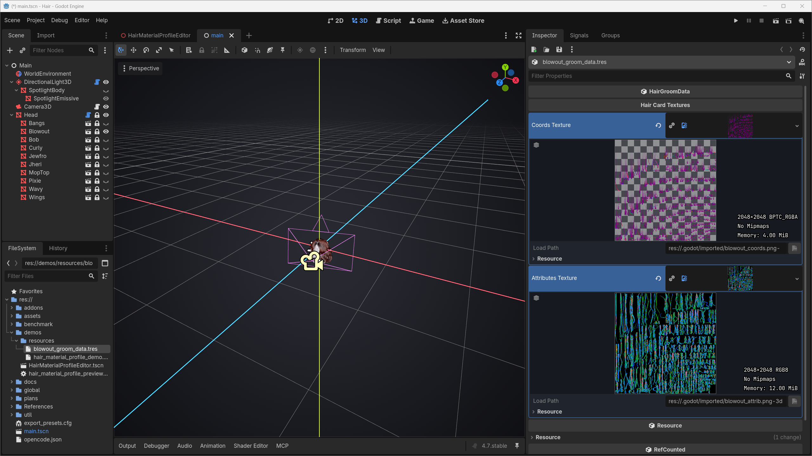](docs/images/new-groom-01-hair-groom-data.png)

*Screenshot 1 — `HairGroomData` owns the card-atlas maps; the channel
contracts are not appearance-texture slots.*

### 2. Create the `HairMaterialProfile` resource

1. In the same folder, choose **New > Resource... > HairMaterialProfile**, then
   save it as `new_hair_material_profile.tres`.
2. Select the profile and open **Quality > `quality_tier`** in the Inspector.
3. Choose one of `Approx / Kajiya-Kay`, `Fast Marschner`, `Cinematic
   Marschner`, or `Reference Marschner`. The selected mode reveals its own
   controls; Fast Marschner, for example, exposes `absorption_mode` and its
   mode-specific absorption fields.

[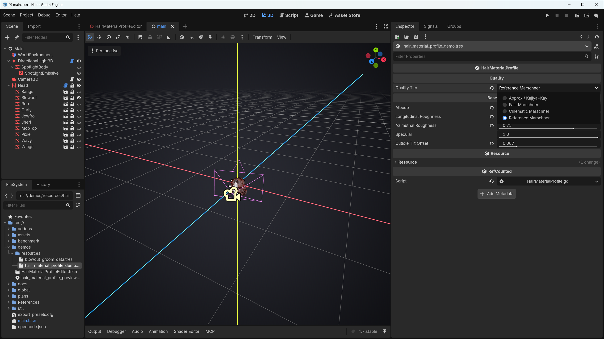](docs/images/new-groom-02-hair-material-profile.png)

*Screenshot 2 — `quality_tier` selects the compiled shader and the Inspector
hides controls that do not affect that mode.*

### 3. Assign the composed `ShaderMaterial` to the mesh

1. Open `res://demos/HairMaterialProfileEditor.tscn`.
2. Select the root `HairMaterialProfileEditor` node. In **Hair Setup**, assign
   `material_profile` to `res://demos/resources/hair_material_profile_demo.tres`
   and `groom_data` to `res://demos/resources/blowout_groom_data.tres`.
3. The `@tool` preview resolves the `HairPreview` MeshInstance3D and writes the
   generated `ShaderMaterial` to its `material_override`. Change
   `quality_tier` and watch the editor viewport refresh.

For your own scene, the simplest path is to let `create_material()` construct
and configure the `ShaderMaterial`, then assign it to the hair mesh. Passing the
owning viewport is recommended when `coverage_mode = Auto`, because it resolves
the initial AA-dependent shader variant immediately:

```gdscript
var material: ShaderMaterial = profile.create_material(groom_data, get_viewport())
hair_mesh.material_override = material
```

This is **not** a second required assignment step for the editor workflow; the
preview scene performs the same work automatically. Use `apply_to()` only when
your code already owns a `ShaderMaterial` and needs an explicit success result:

```gdscript
var material := ShaderMaterial.new()
if not profile.apply_to(material, groom_data, get_viewport()):
	push_error("Hair material setup failed")
	return
hair_mesh.material_override = material
```

Both paths bind the groom textures and the packaged Fast/Cinematic LUTs. Choose
one path, not both.

[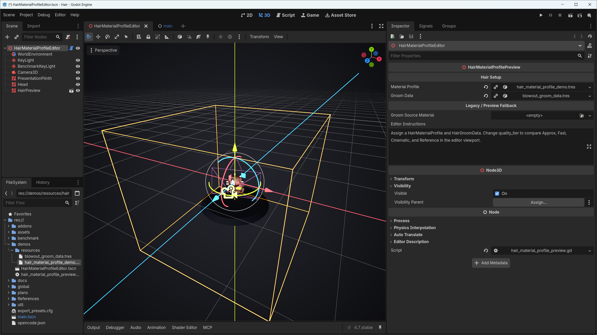](docs/images/new-groom-03-material-assignment.png)

*Screenshot 3 — profile + groom data become a `ShaderMaterial`, then land on
`MeshInstance3D.material_override`.*

## Visual previews

The demo groom and these captures are released under **CC BY-NC 4.0**. The GIFs
below are bundled with this package and render from an extracted copy without
any network access. The Reference Marschner tier is intentionally omitted from
release media.

### Quality tiers (dry)

| Tier | Preview |
| --- | --- |
| Approx / Kajiya-Kay | 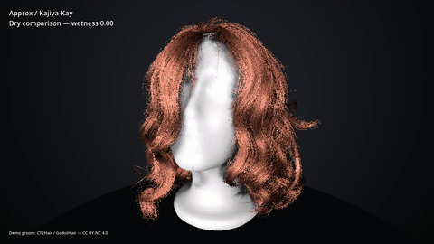 |
| Fast Marschner | 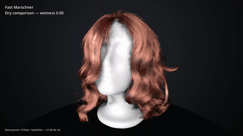 |
| Cinematic Marschner | 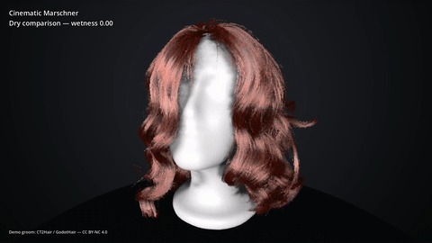 |

### Wetness response matrix

Rows are `wetness` values (0 dry → 1 saturated); columns are quality tiers.

| Wetness | Approx | Fast Marschner | Cinematic Marschner |
| --- | --- | --- | --- |
| 0.00 | 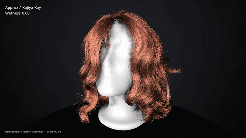 | 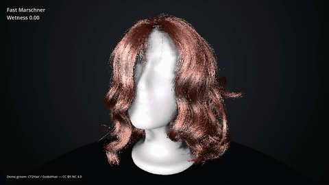 | 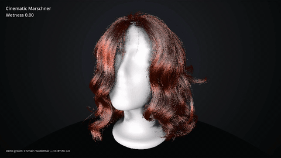 |
| 0.33 | 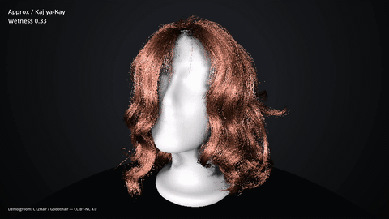 |  | 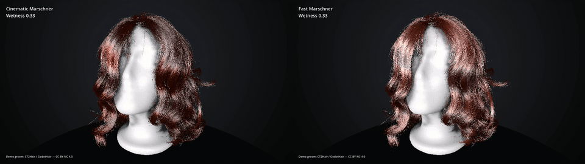 |
| 0.67 | 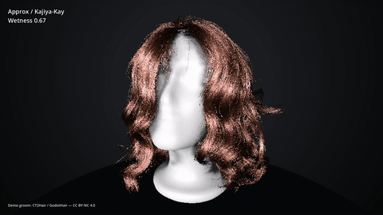 | 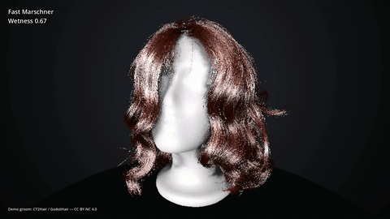 | 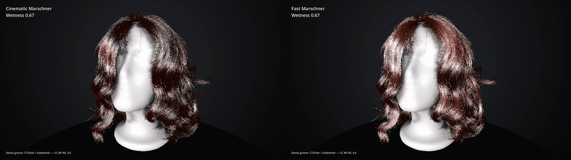 |
| 1.00 | 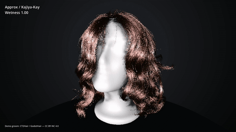 | 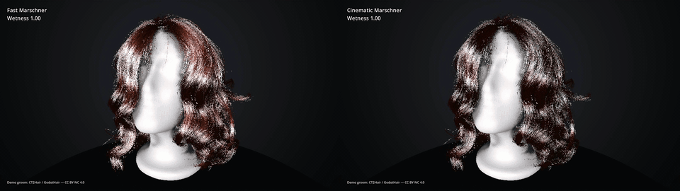 | 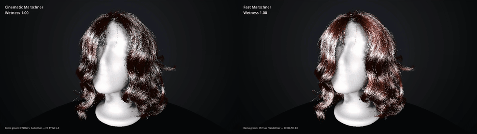 |

Optional full-resolution MP4 captures of the Fast and Cinematic tiers are
attached to the [PR13 demo media release](https://github.com/44madfire/GodotMarschnerHairShader/releases/tag/pr13-demo-media):
[quality-tiers.mp4](https://github.com/44madfire/GodotMarschnerHairShader/releases/download/pr13-demo-media/quality-tiers.mp4),
[fast-wetness.mp4](https://github.com/44madfire/GodotMarschnerHairShader/releases/download/pr13-demo-media/fast-wetness.mp4),
and
[cinematic-wetness.mp4](https://github.com/44madfire/GodotMarschnerHairShader/releases/download/pr13-demo-media/cinematic-wetness.mp4).

## Embedded addon (MIT)

`addons/marschner_hair/` is the validated production runtime:

- `HairMaterialProfile`, `HairGroomData`, `HairMarschnerLUTAdapter`,
  `HairCoveragePolicy`, `HairCoverageController` — authoring/runtime APIs.
- `shaders/` — Approx, Fast Marschner, Cinematic Marschner, and Reference
  Marschner tiers, each with a normal and an alpha-to-coverage variant.
- `luts/` — the Fast (64x64x64 RGBA16F) and Cinematic (128x128x64 R16F)
  production LUTs as directly serialized `ImageTexture3D` resources. They are
  packaged: no LUT-generation step is needed.

The addon is distributed under the MIT License (see `LICENSE`). Third-party
attributions for code and assets are in `THIRD_PARTY_NOTICES.md`.

## Supplied demo grooms (CC BY-NC 4.0)

The demo hair-card meshes and groom maps under `assets/hair/models/**` are
adapted from the CT2Hair dataset (Meta Research) via the GodotHair project
and are **not** part of the MIT license. They remain under
**Creative Commons Attribution-NonCommercial 4.0 International (CC BY-NC 4.0)** —
see `assets/hair/models/LICENSE.md` and `THIRD_PARTY_NOTICES.md` for the full
attribution. Do not use these grooms in commercial projects; replace them with
your own appropriately licensed models.

## Standalone addon archive

The standalone MIT addon archive (no demo grooms, no demo media) is released
separately from this demo package. The `addons/marschner_hair/` tree embedded
here is byte-identical to that validated addon build; for an addon-only
distribution, copy just `addons/marschner_hair/` plus the MIT `LICENSE` and
`THIRD_PARTY_NOTICES.md` into your project.

## Licensing summary

| Path | License |
| --- | --- |
| Project code, embedded addon (`addons/marschner_hair/`, scripts, shaders) | MIT |
| Demo grooms and maps (`assets/hair/models/**`) | CC BY-NC 4.0 |
| Upstream reference code (GodotHair) | MIT (see `THIRD_PARTY_NOTICES.md`) |

See `CHANGELOG.md` for release history and `VERSION` for the current version.
