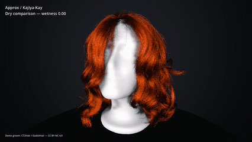
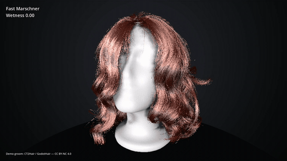
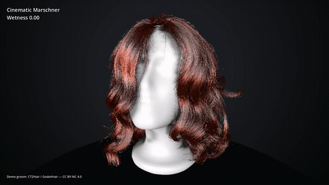

# Release validation helper tools

Two small helpers support the package/media gates in `docs/release_validation.md`.

## Verify the demo embeds the exact addon build

After staging the standalone addon and demo package:

```bash
python benchmark/tools/verify_release_addon_identity.py \
  /path/to/addon-staging/addons/marschner_hair \
  /path/to/demo-staging/addons/marschner_hair
```

Expected marker:

```text
RELEASE_ADDON_IDENTITY_OK
```

The comparison is recursive and byte-exact (SHA-256 per file). Missing, extra, or changed files fail the check.

## Capture release/demo videos

From the validated demo package/project:

```bash
python benchmark/tools/capture_release_media.py \
  --godot /path/to/godot \
  --project .
```

Expected marker:

```text
RELEASE_MEDIA_CAPTURE_OK
```

See `docs/release_media.md` for clip contents, licensing, visual review, and output details.

## Demo video previews

Looping GIF previews of the validated captures live in this repository under
`docs/images/` (source MP4s stay attached to the private
[PR13 demo media release](https://github.com/44madfire/GodotMarschnerHairShader/releases/tag/pr13-demo-media)).
The demo groom and these videos are released under **CC BY-NC 4.0**.

| Capture | Preview |
| --- | --- |
| [Quality tiers](https://github.com/44madfire/GodotMarschnerHairShader/releases/download/pr13-demo-media/quality-tiers.mp4) | [](https://github.com/44madfire/GodotMarschnerHairShader/releases/download/pr13-demo-media/quality-tiers.mp4) |
| [Fast Marschner wetness](https://github.com/44madfire/GodotMarschnerHairShader/releases/download/pr13-demo-media/fast-wetness.mp4) | [](https://github.com/44madfire/GodotMarschnerHairShader/releases/download/pr13-demo-media/fast-wetness.mp4) |
| [Cinematic Marschner wetness](https://github.com/44madfire/GodotMarschnerHairShader/releases/download/pr13-demo-media/cinematic-wetness.mp4) | [](https://github.com/44madfire/GodotMarschnerHairShader/releases/download/pr13-demo-media/cinematic-wetness.mp4) |
